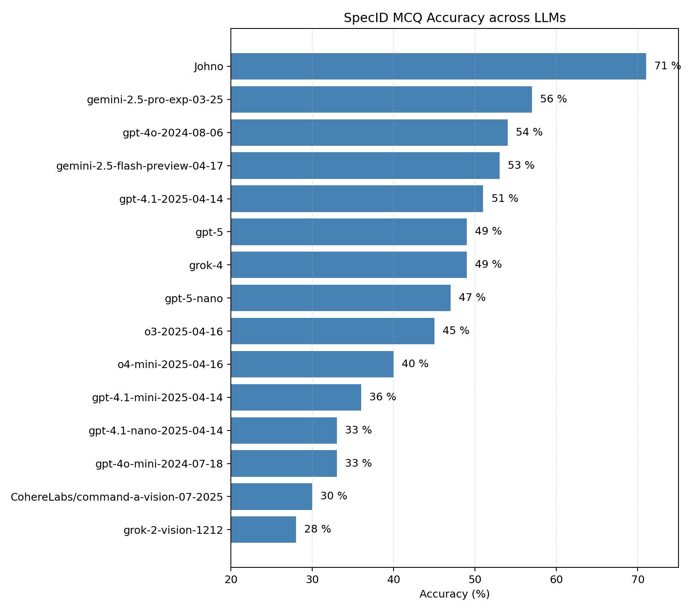

# specid_eval

A hard eval for multi-modal models.

This is based on 100 photographs I took of organisms in Southern Africa, with robust species-level identifications. Each comes with up to four other related 'distractors', and the goal is to correctly guess which is the correct species name. 

To run for a model:
`python run_eval.py "gpt-4.1-nano-2025-04-14" --samples 10`

To run for the set of models I used:
`./run_evals.sh`

Currently supports OpenAI and Google models, LMK if you try   others!

Evals on popular models coming soon

See the code: https://nbsanity.com/static/6e28bac87fb67f2a0b6678718609193d/CreateSpecIDEval.html

Dataset link: https://huggingface.co/datasets/johnowhitaker/specid_eval_jw
